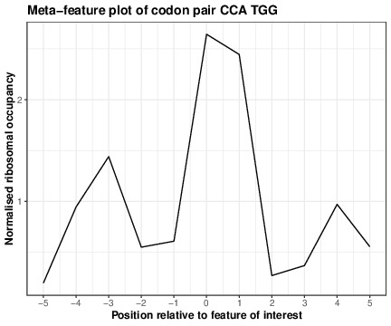

# Running `YAL5-codon-pairs.R`

`YAL5-codon-pairs.R` aims to help study translation by creating a meta feature plot showing the region surrounding the feature of interest. This can be used to investigate whether specific features have an impact on translation, e.g. an inhibitory effect. If the feature is being translated more slowly than its surrounding codons this will generate a peak as its relative ribosome occupancy will be higher than the surrounding landscape. 

## Inputs

`YAL5-codon-pairs.R` looks into meta features, currently the translational landscape surrounding codon pairs. The files needed as inputs are:

* H5 file.
* GFF3 file.
* TSV codon positions file.

Read counts are fetched from the H5 file of a sample and the counts are assigned to the corresponding codon pair position for the genes using the species-specific GFF3 file and a TSV file containing the codon positions for all genes of the species being studied, for example, `data/yeast_codon_table.tsv`.

`YAL5-codon-pairs.R` calculates the normalised number of reads within a window surrounding each occurrence of the feature of interest (e.g. a codon pair) which are then overlayed to generate a single plot. Normalisation is carried out within a set window of codons adjacent to the feature of interest. The default value of this window is currently 5 codons either side of the feature of interest. 

## Outputs

There are  two potential outputs when running `YAL5-codon-pairs.R`.

The first potential output is a PDF of a graph plotting the average relative number of reads mapping to each position relative to the feature of interest within the desired window. This is produced if only one pair is given as a feature of interest, for example the codon pair "CGA GCC".

The second ptential output is a table in the form of a TSV file. This is produced when multiple features are given in the form of a TSV file as the input for the feature of interest argument; for example all possible codon pairs. This table will contain the average relative count at the relative position 0 for each of the features. These are then ranked in descending order by their relative counts. This will allow for the identification of features that have a high average relative count, so are potentially inhibitory.

**Note:** When given a file with multiple features of interest, `YAL5-codon-pairs.R` expects them to be in the first column of the TSV file.

## Execution

`YAL5-codon-pairs.R` requires seven arguments:

* `-i` or `--input`: Path to the H5 input file.
* `-d` or `--dataset`: Name of the dataset of the sample being studied.
* `-g` or `--gff`: Path to the GFF3 file of the species being studied.
* `-a` or `--annotation`: Path to codon table for the species (TSV file)
* `--asite_length`: Path to species-specific A-site displacement length file. An example can be found in `data/yeast_standard_asite_disp_length.txt`.
* `--feature`: Feature (codon pair) of interest. If multiple features (codon pairs) are being studied then they should be contained within a TSV file with a 'Codon pair' header.
* `-o` or `--output`: Path to output directory, default ".".

There are a number of optional arguments that can be used to change how `YAL5-codon-pairs.R` processes the data, such as the size of the expanded window, the size of the desired reading frame (or counts for all reading frames can be kept) but these are not required as they have default values:

* `--expand_width`: The desired range either side of the feature of interest to be used for normalization, default = 5.
* `--frame`:  Reading frame to be studied, default = 0.
* `--minreadlen`: Minimum read length, default = 10.
* `--filter_for_frame`: Counts for all reading frames per codon are summed and assigned to their corresponding codon. Keep all by not filtering (FALSE) or filter for the specific reading frame, specified in `--frame`, (TRUE), default = TRUE.
* `--snapdisp`: Reading frame to filter for, if `--filter_for_frame = TRUE`, default = 0.

`YAL5-codon-pairs.R` can be run  with the command:

```console
$ Rscript rscripts/YAL5-codons-pairs.R \
	-i [Path to H5 file] \
 	-d [Dataset] \
	-g [Path to GFF3 file] \
	-a [Path to species-specific codon table] \
        --asite_length [Path to the A-site displacement length file] \
	--feature [individual feature pair to be studied or path to TSV file containing multiple feature pairs] \
	-o [Output directory]
```

## Examples

The examples assume that `YAL5-codon-pairs.R` is being run from the riboviz folder. 

### Single feature of interest

Running on data from the simulated dataset Mok-simYAL5 with the aim of investigating the codon pair 'CCA TGG' the command would be: 

```console
$ Rscript rscripts/YAL5-codon-pairs.R -i data/Mok-simYAL5/A.h5 -d Mok-simYAL5 -g data/Mok-simYAL5/Scer_YAL_5genes_w_250utrs.gff3 -a data/yeast_codon_table.tsv --asite_length data/yeast_standard_asite_disp_length.txt --feature "CCA TGG" -o . --minreadlen 10
```

Running `YAL5-codon-pairs.R` with a single feature of interest argument produces a PDF with the following image:



### Multiple features of interest

Running on data from the simulated dataset Mok-simYAL5 with the aim of investigating multiple codon pairs, provided as a TSV file, the command would be: 

```console
$ Rscript rscripts/YAL5-codon-pairs.R -i data/Mok-simYAL5/A.h5 -d Mok-simYAL5 -g data/Mok-simYAL5/Scer_YAL_5genes_w_250utrs.gff3 -a data/yeast_codon_table.tsv --asite_length data/yeast_standard_asite_disp_length.txt --feature data/codon-pairs.tsv -o .
```

Running `YAL5-codon-pairs.R` with a TSV file containing multiple features of interest produces a file containing the following output format:

```
$ cat Feature_Relative_use.tsv 
Feature	RelCount
TCA TAC	4.35117056856187
TGG GGT	3.37584832195823
CCA TGG	2.64338038234769
GGT ACT	2.09842494819703
GAC TAC	1.64597564484755
GAT GAC	1.03749270563895
AAG GAG	0.888791664708861
GTA GTG	0.808476394849785
AGA TGG	0.776561043802423
TTC GGT	0.190249390825772
ACC TGG	0.15017667844523
```

**Note:** If the TSV file has only one codon pair then a PDF is output as for the Single feature of interest mode of operation.
