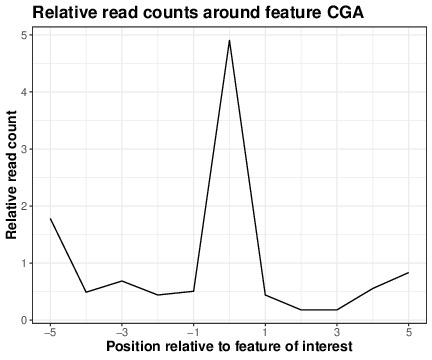

# Running YAL5-single-codons.R

### Inputs 

YAL5-single-codons.R looks into metafeatures, currently specifically codon use. It takes reads from the H5 file of a sample and assigns them to the corresponding codon position in a gene using the species GFF3 file and  
a tsv file listing the codons for all genes of the species being studied, i.e. the `yeast_codon_table.tsv` which is availble in `riboviz/data`. The script runs to calculate the average relative number of reads mapping to a feature of interest, relative to a window of
codons adjacent to the feature. The default value of this window is 5 codons either side of the feature of interest. This can be used to study how inhibitory a feature is, as more inhibitory features will have a larger average 
relative read value. 


### Outputs

There are currently two potential outputs when running `YAL5-single-codons.R`. 

The first is a pdf of a graph plotting the average relative number of reads (RelCount) mapping to each position in the desired window (RelPos) around the feature of interest.
This is produced if only one feature is given, for example codon 'CGA'.

The second potential output is a table in the form of a tsv file. This is produced when multiple features are given in the form of a tsv file as the input for the feature_of_interest argument; for example all possible codons. This table will contain the average relative count of 
each feature, and rank them in descending order. This will allow for the identification of features that have a high average relative count, so are potentially inhibitory. 

NOTE: When giving multiple features of interest, the script is expecting them to be in the first column of a tsv file. 


### Arguments 

This script requires six arguments; the H5 file, the dataset of the sample being studied, the GFF3 file, the codon_table, a feature - currently an individual codon or a file containing multiple codons, and an output directory. 
There are a number of arguments that can be used to change how the script processes the data, such as if a reading frame is filtered for and which one, but these are not required as they have default values.


The `YAL5-single-codons.R` script can be run from the riboviz directory with the command:

```
Rscript rscripts/YAL5-single-codons.R 
	-i [Path to H5 file]
 	-d [Dataset] 
	-g [Path to GFF3 file] 
	-a [Path to codon table for organism]
	 --feature [individual feature to be studied or path to TSV file containing multiple features] 
	-o [Output directory]
```

available arguments:

```
'-i' or '--input'. Path to the input to h5 file
'-d' or '--dataset'. Name of the dataset being studied
'-g' or '--gff'. Path to the GFF3 file of the organism being studied
'-a' or '--annotation'. Path to codon table for organism
'--feature'. Feature of interest, e.g. CGA. If multiple features are being studied then they should be contained within a tsv file.  
'-o' or '--output'. Path to output directory
'--expand_width'. The desired range either side of the feature of interest to be used for normalization, default = 5
'--frame'.  Reading frame to be studied, default = 0
'--minreadlen'. minimum read length, default = 10
'--filter_for_frame' Filter to include only the reads from one nucleotide of a codon, decided by the argument '--frame', default = TRUE
'--snapdisp' 'Frame to filter to when using SnapToCodon', default = 0L

```

The required arguments are: -i, -d, -g, -a, --feature, and -o. Other argument options have defaults that can be changed.


### Examples: 

The examples assume that the script is being run from the riboviz folder

**Single feature of interest**

```
Rscript rscripts/YAL5-single-codons.R -i Mok-simYAL5/output/A/A.h5 -d Mok-simYAL5 -g ../example-datasets/simulated/mok/annotation/Scer_YAL_5genes_w_250utrs.gff3 -a data/yeast_codon_table.tsv --feature CGA -o .
```

Running `YAL5-single-codons.R` with a single feature_of_interest argument produces a PDF with the following image:




**Multiple features of interest**
```
Rscript rscripts/YAL5-single-codons.R -i Mok-simYAL5/output/A/A.h5 -d Mok-simYAL5 -g ../example-datasets/simulated/mok/annotation/Scer_YAL_5genes_w_250utrs.gff3 -a data/yeast_codon_table.tsv --feature data/codons.tsv -o .
```

Running `YAL5-single-codons.R` with a TSV containing multiple features of interest as the feature_of_interest argument produces a file containing the following output format:

```
Feature	RelCount
CGA	2.30033370411568
CTC	1.95209626966086
AGG	1.85391041724436
GCG	1.81696428571429
TGC	1.72677661461294
TGG	1.48950846086332
GCA	1.4872624105102
GTA	1.48627944639399
AGC	1.47948869857231
GTG	1.45266557210408
```


