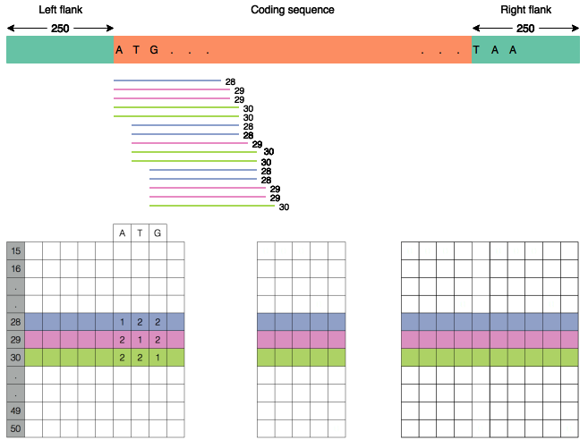
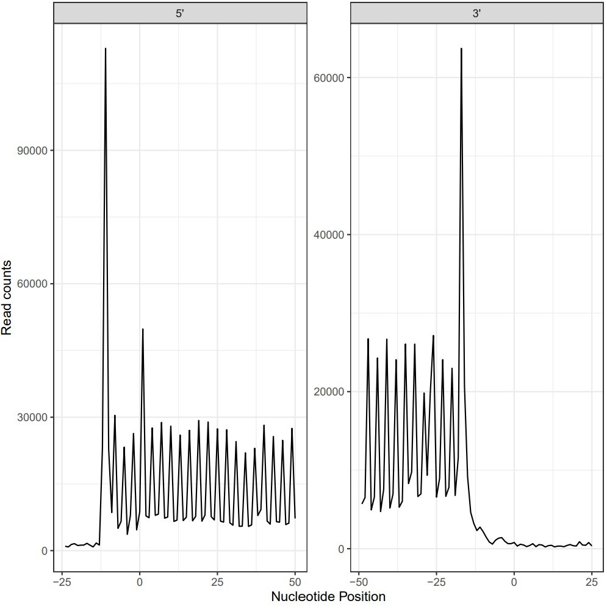
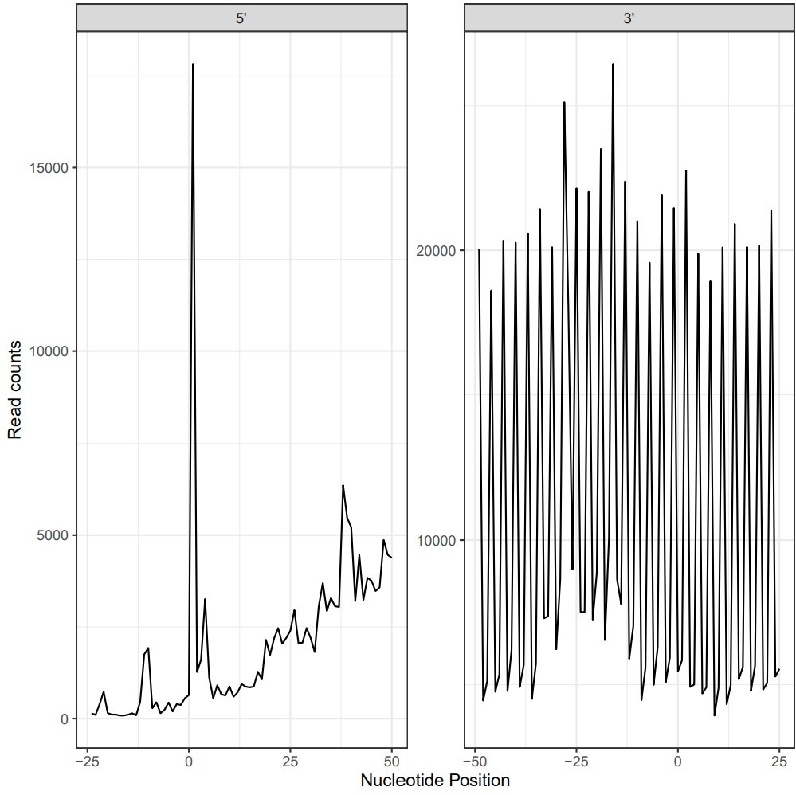
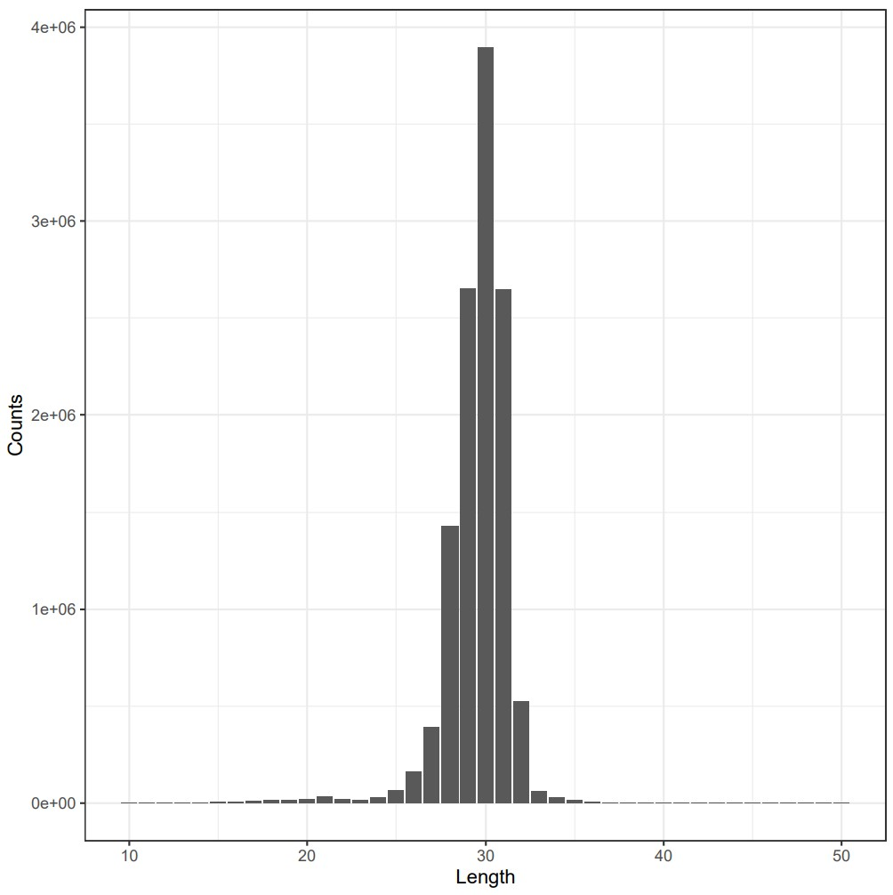
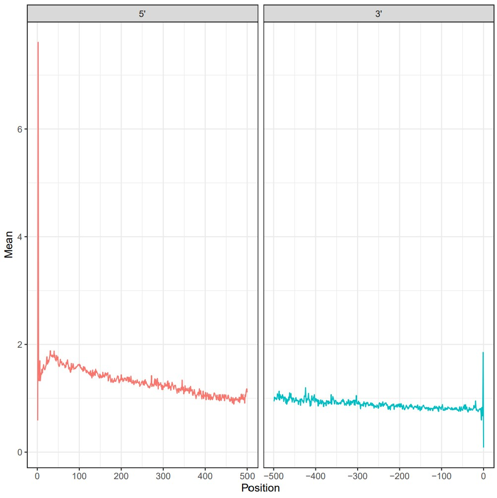
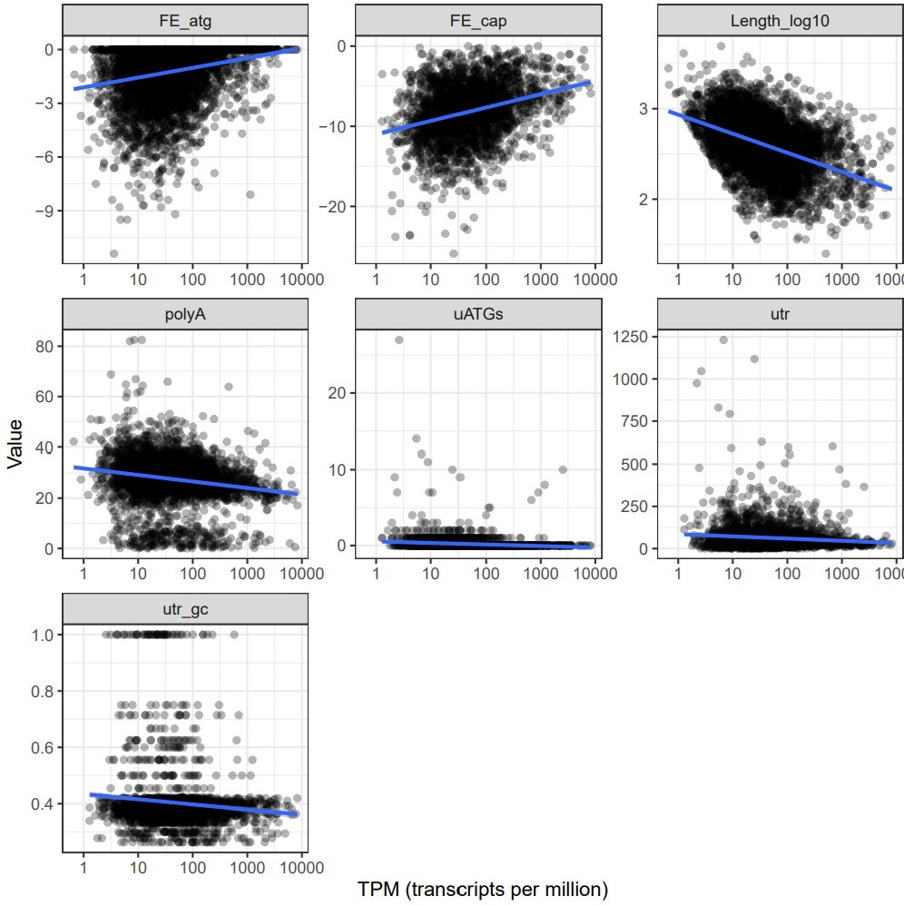
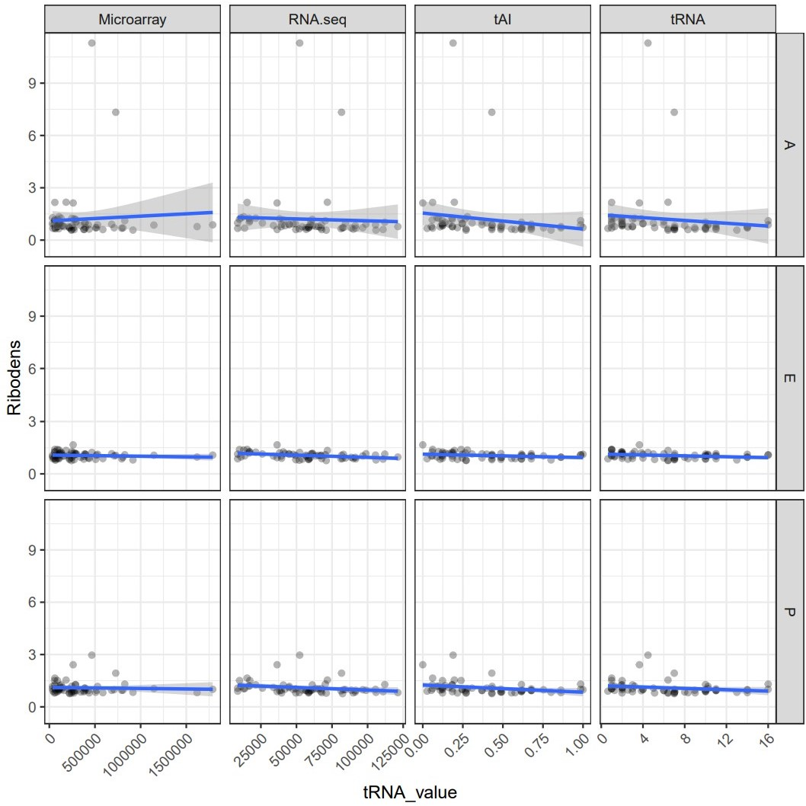
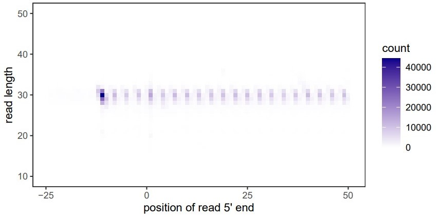

# riboviz output files and figures

This document lists the output files from a typical riboviz run, along with short descriptions. When first looking at outputs of a riboviz run, `read_counts_by_length.pdf` and `metagene_start_stop_read_counts.pdf` will be a good starting point for accessing the success of the run and the quality of the data used, as described below. 

**Initial Quality control checks**

When looking at the `read_counts_by_length.pdf`, it is expected to see a peak of reads at 28-31nt. If the adapter or UMI (Unique Molecular Identifiers) sequence given in the config file does not match those used in the experiment irregularities will be present in the output files. If these sequences are incorrect a clear peak at 28-31nt in `read_counts_by_length.pdf` will not be present. In addition, very few reads may be present as they are unable to align to the annotation files so are discarded at an earlier stage of the pipeline. You can examine `read_counts_per_file.tsv` to check the number of aligned reads at each stage of the pipeline. 

When looking at the `metagene_start_stop_read_counts.pdf`, it is expected to see a peak of reads upstream of the start codon, then repeating smaller peaks every 3nt. Severe disruption of the 3nt periodicity indicates a lower quality dataset and potential issues with the adapter sequence or UMI regular expression. 


Descriptions of specific files can be located quickly using the following links:

**Output files for an entire run**
* [TPMs_all_CDS_all_samples.tsv](#tpms_all_cds_all_samplestsv)
* [read_counts_per_file.tsv](#read_counts_per_filetsv)

**Output files for each samples** 
* [<SAMPLE_ID>_output_report.html](#sample_id_output_reporthtml)
* [<SAMPLE_ID>.bam](#sample_idbam)
* [<SAMPLE_ID>.bam.bai](#sample_idbambai)
* [minus.bedgraph](#minusbedgraph)
* [plus.bedgraph](#plusbedgraph)
* [<SAMPLE_ID>.h5](#sample_idh5)
* [metagene_start_stop_read_counts.tsv](#metagene_start_stop_read_countstsv)
* [metagene_start_stop_read_counts.pdf](#metagene_start_stop_read_countspdf)
* [read_counts_by_length.tsv](#read_counts_by_lengthtsv)
* [read_counts_by_length.pdf](#read_counts_by_lengthpdf)
* [nt_freq_per_read_position.tsv](#nt_freq_per_read_positiontsv)
* [metagene_normalized_profile_start_stop.pdf](#metagene_normalized_profile_start_stoppdf)
* [metagene_normalized_profile_start_stop.tsv](#metagene_normalized_profile_start_stoptsv)
* [ORF_TPMs_vs_features.tsv](#orf_tpms_vs_featurestsv)
* [ORF_TPMs_vs_features.pdf](#orf_tpms_vs_featurespdf)
* [ORF_TPMs_and_counts.tsv](#ORF_TPMs_and_countstsv)
* [normalized_density_APEsites_per_codon.tsv](#normalized_density_APEsites_per_codontsv)
* [normalized_density_APEsites_per_codon_long.tsv](#normalized_density_APEsites_per_codon_longtsv)
* [normalized_density_APEsites_per_codon.pdf](#normalized_density_APEsites_per_codonpdf)
* [metagene_position_length_counts_5start.tsv](#metagene_position_length_counts_5starttsv)
* [metagene_start_barplot_by_length.pdf](#metagene_start_barplot_by_lengthpdf)
* [metagene_start_ribogrid_by_length.pdf](#metagene_start_ribogrid_by_lengthpdf)
* [read_frame_per_ORF.tsv](#read_frame_per_ORFtsv)
* [read_frame_per_ORF_filtered.tsv](#read_frame_per_ORF_filteredtsv)
* [frame_proportions_per_ORF.pdf](#frame_proportions_per_ORFpdf)

After a riboviz run, many output files are produced within the output directory.
The output directory is specified by the parameter `dir_out` in the YAML configuration file.

There are a few output files that collect information for an entire run.
There are many output files that are specific to each sample, which are organized into a separate subdirectory for each sample. 


# Output files for an entire run


## `TPMs_all_CDS_all_samples.tsv` 

A tsv file with transcripts per million (tpm) for all genes from successfully processed samples. This file is produced by the script `collate_TPMs.R`. This script uses the `ORF_TPMs_and_counts.tsv` file from each processed sample and lists the tpms of each sample for each gene, allowing for comparison between samples. 

```
ORF	ANAPH_1	VEG_1
Q0045	54.5	0.7
Q0050	0.6	0.7
Q0055	0.6	0.1
Q0060	2.2	0.1
Q0065	22.2	1
Q0070	22.8	0.7
```


## `read_counts_per_file.tsv` 

A read counts file (only if `count_reads: TRUE`).

The workflow will summarise information about the number of reads in the input files and in the output files produced at each step of the workflow. This summary is produced by scanning input, temporary and output directories and counting the number of reads (sequences) processed by specific stages of a riboviz workflow.

The read counts file, `read_counts_per_file.tsv`, is written into the output directory.

The reads counts file is a tab-separated values (TSV) file with the following columns:

* `SampleName`: Name of the sample to which this file belongs. This is
  an empty value if the step was not sample-specific
  (e.g. demultiplexing a multiplexed FASTQ file).
* `Program`: Program that wrote the file. The special token
  `input` denotes input files.
* `File`: Path to file.
* `NumReads`: Number of reads in the file.
* `Description`: Human-readable description of the file contents.

The following information is included:

* Input files: number of reads in the FASTQ files used as inputs.
* `cutadapt`: number of reads in the FASTQ file output.
* `riboviz.tools.demultiplex_fastq`: FASTQ files output by
  "demultiplex_fastq", using the information in the associated
  `num_reads.tsv` summary files, or, if these can't be found, the
  FASTQ files themselves.
* `hisat2`: number of reads in the SAM file and FASTQ file output.
* `riboviz.tools.trim_5p_mismatch`: number of reads in the SAM file
  output as recorded in the `trim_5p_mismatch.tsv` summary file
  output, or the SAM file itself, if the TSV file cannot be found (if
  `trim_5p_mismatches: TRUE`)
* `umi_tools dedup`: number of reads in the BAM file output.

Here is an example of a read counts file produced when running the vignette:

```
SampleName	Program	File	NumReads	Description
WTnone	input	vignette/input/SRR1042855_s1mi.fastq.gz	963571	input
WT3AT	input	vignette/input/SRR1042864_s1mi.fastq.gz	1374448	input
WT3AT	cutadapt	vignette/tmp/WT3AT/trim.fq	1373362	Reads after removal of sequencing library adapters
WT3AT	hisat2	vignette/tmp/WT3AT/nonrRNA.fq	485226	rRNA or other contaminating reads removed by alignment to rRNA index files
WT3AT	hisat2	vignette/tmp/WT3AT/rRNA_map.sam	2254078	Reads with rRNA and other contaminating reads removed by alignment to rRNA index files
WT3AT	hisat2	vignette/tmp/WT3AT/unaligned.fq	476785	Unaligned reads removed by alignment of remaining reads to ORFs index files
WT3AT	hisat2	vignette/tmp/WT3AT/orf_map.sam	8698	Reads aligned to ORFs index files
WT3AT	riboviz.tools.trim_5p_mismatch	vignette/tmp/WT3AT/orf_map_clean.sam	8698	Reads after trimming of 5' mismatches and removal of those with more than 2 mismatches
WTnone	cutadapt	vignette/tmp/WTnone/trim.fq	952343	Reads after removal of sequencing library adapters
WTnone	hisat2	vignette/tmp/WTnone/nonrRNA.fq	466464	rRNA or other contaminating reads removed by alignment to rRNA index files
WTnone	hisat2	vignette/tmp/WTnone/rRNA_map.sam	1430213	Reads with rRNA and other contaminating reads removed by alignment to rRNA index files
WTnone	hisat2	vignette/tmp/WTnone/unaligned.fq	452266	Unaligned reads removed by alignment of remaining reads to ORFs index files
WTnone	hisat2	vignette/tmp/WTnone/orf_map.sam	14516	Reads aligned to ORFs index files
WTnone	riboviz.tools.trim_5p_mismatch	vignette/tmp/WTnone/orf_map_clean.sam	14516	Reads after trimming of 5' mismatches and removal of those with more than 2 mismatches
```


# Output files for each sample

For each sample (`<SAMPLE_ID>`), intermediate files are produced in a sample-specific subdirectory (`<SAMPLE_ID>`).


## `<SAMPLE_ID>_output_report.html` 

This output report in .html format contains a provenance section for the sample, all the pdf output files produced by riboviz, and information on any plots not produced such as which files would be needed to produce plots in future runs. The HTML also includes a side bar to allow for navigation between figures. This file is produced by `AnalysisOutputs.Rmd`, which loads and creates all of the output graphs in HTML format.

Example of the top of the HTML file:


Only output if `run_static_html: TRUE`. 


## `<SAMPLE_ID>.bam` 

BAM file of reads mapped to transcripts, which can be directly used in genome browsers. The BAM file is produced by samtools.


## `<SAMPLE_ID>.bam.bai` 

BAM index file for `<SAMPLE_ID>.bam`. This file is produced by samtools.


## `minus.bedgraph` 

Bedgraph of reads from minus strand (if `make_bedgraph: TRUE`).

Because riboviz aligns to the transcriptome, which represents single-stranded positive-sense RNA, there should be very few reads counted in `minus.bedgraph`. This file is produced by bedtools.


## `plus.bedgraph` 

Bedgraph of reads from plus strand (if `make_bedgraph: TRUE`).

Almost all translated reads should be counted in open reading frames within `plus.bedgraph`, again because riboviz aligns to the transcriptome, which represents single-stranded positive-sense RNA. This file is produced by bedtools.


## `<SAMPLE_ID>.h5` 

Length-sensitive alignments of reads in compressed HDF5 format. This file is created from the sample BAM file using `bam_to_h5.R`.

The HDF5 file, `<SAMPLE_ID>.h5`, has external links to complementary HDF5 files, named `<SAMPLE_ID>.h5.1`, `<SAMPLE_ID>.h5.2` etc. each of which hold the data for a subset of genes. The number of data files depends on the number of processes (`num_processes`). For example, if `num_processes` is 1 then the output files will be `<SAMPLE_ID>.h5` (external links file) and `<SAMPLE_ID>.h5.1` (data file). If `num_processes` is 4 then the output files will be `<SAMPLE_ID>.h5` (external links file) and `<SAMPLE_ID>.h5.1`, `<SAMPLE_ID>.h5.2`, `<SAMPLE_ID>.h5.3`, `<SAMPLE_ID>.h5.4` (data files). For more information, see [Structure of riboviz HDF5 data](#structure-of-riboviz-hdf5-data) below.

Information contained within the HDF5 file can be accessed using the functions `GetGeneDataMatrix` and `TidyGeneDataMatrix` in R, which will create a tibble showing the number of reads of each length occurring at each position in a gene. More useful functions for working with a HDF5 file are described in `rscripts/read_count_functions.R`.

### Structure of riboviz HDF5 data

For analyses of ribosome footprinting and RNA-seq datasets, we store summaries of aligned read data in Hierarchical Data Format ([HDF5](https://en.wikipedia.org/wiki/Hierarchical_Data_Format)) format. HDF5 allows for rapid access to mapped reads of a particular length to any coding sequence.

To learn more about accessing and manipulating HDF5 files in R, see Bioconductor's [HDF5 interface to R](https://bioconductor.org/packages/release/bioc/html/rhdf5.html) and Neon's [Introduction to HDF5 Files in R](https://www.neonscience.org/hdf5-intro-r).

**ribovis HDF5 data and `bam_to_h5.R`**

Given a GFF file and a BAM file, `bam_to_h5.R` creates an HDF5 file with information about a feature (e.g. CDS, ORF, or uORF).

It is passed the following configuration parameters from the riboviz configuration (see [Configuring the riboviz workflow](./prep-riboviz-config.md)):

| Parameter | Description |
| --------- | ----------- |
| `buffer` | Length of flanking region around the feature |
| `dataset` | Human-readable name of the dataset |
| `is_riboviz_gff` | Does `orf_gff_file` contain 3 elements per gene - UTR5, feature, and UTR3? |
| `max_read_length` | Maximum read length in H5 output |
| `min_read_length` | Minimum read length in H5 output |
| `num_processes` | Number of processes to parallelize over, used by specific steps in the workflow |
| `orf_gff_file` | Matched genome feature file, specifying coding sequences locations (start and stop coordinates) within the transcripts (GTF/GFF3 file) |
| `primary_id` | Primary gene IDs to access the data (YAL001C, YAL003W, etc.) |
| `secondary_id` | Secondary gene IDs to access the data (COX1, EFB1, etc. or `NULL`) |
| `stop_in_feature` | Are stop codons part of the feature annotations in `orf_gff_file`? |

At present, the default feature is assumed to be `CDS`.

All reads are mapped to their 5' ends.

`primary_id` is the name of an attribute in `orf_gff_file` (e.g. `Name`) expected to hold gene names.

`secondary_id` is the name of an attribute in `orf_gff_file` (e.g. `ID`) expected to hold gene names or, if none, `NULL`. If provided then these alternative gene names are used to create symbolic links in the H5 files to the entries for each  gene.

`primary_id` is used as GFF column e.g. "Name".

`secondary_id` is used as a GFF column to get alternative gene names which are associated with gene names. These are used to create symbolic links in the H5 file to the entries for the original genes.

If `is_riboviz_gff` then:

* Feature (e.g. `CDS`, `ORF`, or `uORF`), `UTR5` and `UTR3` entries from `orf_gff_file` are used.
* `buffer` is ignored.

If not `is_riboviz_gff` then:

* Feature (e.g. `CDS`, `ORF`, or `uORF`) entries from `orf_gff_file` are used.
* `UTR5` and `UTR3` entries from `orf_gff_file` are ignored.
* `buffer` is used as the width of left and right flanks.
* `stop_in_feature` states where the stop codon is located (true if within the feature, false otherwise).

### riboviz HDF5 file structure

An HDF5 file, `hd_file`, is created that has external links to complementary HDF5 files, named `<hd_file>.1`, `<hd_file>.2` etc. each of which hold the data for a subset of genes. The number of data files depends on the number of processes (`num_processes`). For example, if `num_processes` is 1 then the output files will be `<hd_file>` (external links file) and `<hd_file>.1` (data file). If `num_processes` is 4 then the output files will be `<hd_file>` (external links file) and `<hd_file>.1`, `<hd_file>.2`, `<hd_file>.3`, `<hd_file>.4` (data files).

Each complementary HDF5 data file has approximately the same number of genes i.e. approximately number of genes / `num_processes`.

The HDF5 file, `hd_file`, has the following structure:

```
GROUP "/" {
  EXTERNAL_LINK "<gene<1>>" {
     TARGETFILE "<hd_file>.1"
     TARGETPATH "<gene<1>>"
  }
 ...
  EXTERNAL_LINK "<gene<m>>" {
     TARGETFILE "<hd_file>.2"
     TARGETPATH "<gene>m>>"
  }
 ...
  EXTERNAL_LINK "<gene<n>>" {
     TARGETFILE "<hd_file>.<num_processes>"
     TARGETPATH "<gene<n>>"
  }
...
}
```

The complementary HDF5 data files, `<hd_file>.<i>`, each have the following structure.

The `reads` group, `/<gene>/<dataset>/reads`, for a `<gene>` has several attributes associated with it. These are summary statistics and other information about the gene and dataset within the `reads` group. The list of attributes are as follows.

| Attribute | Description | Origin |
| --------- |------------ | ------ |
| `buffer_left` | Number of nucleotides upstream of the start codon (ATG) (UTR5 length) | EITHER position of start codon (from `orf_gff_file`) - 1 OR, if `is_riboviz_gff` is false, `buffer` |
| `buffer_right` | Number of nucleotides downstream of the stop codon (TAA/TAG/TGA) (UTR3 length) | From `orf_gff_file` OR, if `is_riboviz_gff` is false, `buffer` + feature length from `orf_gff_file` + `buffer` - `stop_codon_pos[3]` (see below) |
| `start_codon_pos` | Positions corresponding to start codon of feature (typically 251, 252, 253) | From `orf_gff_file` |
| `stop_codon_pos` | Positions corresponding to stop codon of feature | Positions from `orf_gff_file`. If `is_riboviz_gff` is false and `stop_in_feature` is false, position is last nucleotide of feature + 1 |
| `lengths` | Lengths of mapped reads | Range from `min_read_length` to `max_read_length` (e.g. 10,...,50) |
| `reads_by_len` | Counts of number of ribosome sequences of each length | BAM file |
| `reads_total` | Total number of ribosome sequences | BAM file. Equal to number of non-zero reads in `reads_by_len` |

Each complementary HDF5 data file, `<hd_file>.<i>`, is organized in a hierarchy, `/<gene>/<dataset>/reads/data`, where `<gene>` is each gene name in `bam_file` and `orf_gff_file`.

The `data` table in `/<gene>/<dataset>/reads/data`, for a `<gene>` has the positions and lengths of ribosome sequences within the organism data (determined from the BAM file). It is an integer table with each row representing a read length and columns representing nucleotide positions. The first row corresponds to reads of length `min_read_length` and the last row corresponds to reads of length `max_read_length`.

A template HDF5 data file, showing how the complementary HDF5 data files relate to information in the riboviz configuration (and `bam_to_h5.R command-line parameters), `orf_gff_fasta` and a BAM file is as follows:

```
HDF5 "<hd_file>.<i>" {
GROUP "/" {
   GROUP "<gene>" {
      GROUP "<dataset>" {
	 GROUP "reads" {
	    ATTRIBUTE "buffer_left" {
	       DATATYPE  H5T_STD_I32LE
	       DATASPACE  SIMPLE { ( 1 ) / ( 1 ) }
	       DATA {
	       (0): <Feature UTR5 length from orf_gff_file OR buffer (if is_riboviz_gff is false)>
	       }
	    }
	    ATTRIBUTE "buffer_right" {
	       DATATYPE  H5T_STD_I32LE
	       DATASPACE  SIMPLE { ( 1 ) / ( 1 ) }
	       DATA {
	       (0): <Feature UTR3 length from orf_gff_file OR buffer (if is_riboviz_gff is false)>
	       }
	    }
	    ATTRIBUTE "lengths" {
               DATATYPE  H5T_STD_I32LE
               DATASPACE  SIMPLE { (<read_length>) / (<read_length>) }
               DATA {
               (0): <min_read_length>, <min_read_length> + 1, ... , <min_read_length> + <m> - 1,
               (<m>): <min_read_length>+<m>, <min_read_length> + <m> + 1, ... , <min_read_length> + <n> - 1,
               (<n>): <min_read_length>+<n>, <min_read_length> + <n> + 1, ... , <min_read_length> + <max_read_length>
               }
            }
            ATTRIBUTE "reads_by_len" {
               DATATYPE  H5T_STD_I32LE
               DATASPACE  SIMPLE { (<read_length>) / (<read_length>) }
               DATA {
               (0): <see below>
               (<m>): <see below>
               (<n>): <see below>
               }
            }
           ATTRIBUTE "reads_total" {
               DATATYPE  H5T_STD_I32LE
               DATASPACE  SIMPLE { ( 1 ) / ( 1 ) }
               DATA {
               (0): <number of non-zero values in reads_by_len>
               }
            }
            ATTRIBUTE "start_codon_pos" {
               DATATYPE  H5T_STD_I32LE
               DATASPACE  SIMPLE { ( 3 ) / ( 3 ) }
               DATA {
               (0): <position of 1st nt of feature start codon from orf_gff_file>,
		    <position of 2nd nt of feature start codon from orf_gff_file>,
		    <position of 3rd nt of feature start codon from orf_gff_file>
               }
            }
            ATTRIBUTE "stop_codon_pos" {
               DATATYPE  H5T_STD_I32LE
               DATASPACE  SIMPLE { ( 3 ) / ( 3 ) }
               DATA {
               (0): <position of 1st nt of feature stop codon from orf_gff_file>,
	            <position of 2nd nt of feature stop codon from orf_gff_file>,
	            <position of 3rd nt of feature stop codon from orf_gff_file>
               }
            }
            DATASET "data" {
               DATATYPE  H5T_STD_I32LE
               DATASPACE  SIMPLE { ( <sequence_length>, <read_length> ) /
	                           ( <sequence_length>, <read_length> ) }
               DATA {
               (0, 0): <see below>
               (0, <m>): <see below>
               (0, <n>): <see below>
               ...
               (<p>, 0): <see below>
               (<p>, <m>): <see below>
               (<p>, <n>): <see below>
               ...
               (<sequence_length - 1>, 0): <see below>
               (<sequence_length - 1>, <m>): <see below>
               (<sequence_length - 1>, <n>): <see below>
               }
            }
         }
      }
   }
   ...
}
```

where:


* `gene`: Gene ID from `orf_gff_file` `primary_id` attribute.
* `read_length`: `max_read_length` - `min_read_length` + 1
* 0 < `m` < `n` < `read_length`. Exact values of `m` and `n` may differ across specific `ATTRIBUTE` and `DATA` items.
* `reads_by_len`:
  - `reads_by_len[i]` = number of alignments in BAM file which have `Flag` equal to 0 or 256 and length equal to `lengths[i]`. This equals the sum of `DATA[*, i]` i.e. sum across all positions for a specific read length.
* `sequence_length`: position of final nucleotide of UTR3 from `orf_gff_file` (equal to length of sequence from BAM file header `LN` value).
  - If `is_riboviz_gff` is false when this is equal to `buffer` + feature length + `buffer`.
* `DATASET "data"`:
  - 0 <= `p` <= `sequence_length - 1`
  - `DATA[p, i]` equals 1 if there is an alignment in the BAM file at position `p`+1 which has length equal to `lengths[i]` and alignment has `Flag` value 0 or 256 (see [Understanding the BAM flags](https://davetang.org/muse/2014/03/06/understanding-bam-flags/) and [Decoding SAM flags](https://broadinstitute.github.io/picard/explain-flags.html)); 0 otherwise.

### Example

A snippet from an example HDF5 file is shown below. 

```
                              group              name       otype  dclass       dim
0                                 /           YAL001C   H5I_GROUP                  
1                          /YAL001C 2016_Weinberg_RPF   H5I_GROUP                  
2        /YAL001C/2016_Weinberg_RPF             reads   H5I_GROUP                  
3  /YAL001C/2016_Weinberg_RPF/reads              data H5I_DATASET INTEGER 36 x 3980
4                                 /           YAL002W   H5I_GROUP                  
5                          /YAL002W 2016_Weinberg_RPF   H5I_GROUP                  
6        /YAL002W/2016_Weinberg_RPF             reads   H5I_GROUP                  
7  /YAL002W/2016_Weinberg_RPF/reads              data H5I_DATASET INTEGER 36 x 4322
8                                 /           YAL003W   H5I_GROUP                  
9                          /YAL003W 2016_Weinberg_RPF   H5I_GROUP                  
10       /YAL003W/2016_Weinberg_RPF             reads   H5I_GROUP                  
11 /YAL003W/2016_Weinberg_RPF/reads              data H5I_DATASET INTEGER 36 x 1118
```

The figure below shows an example where `min_read_length` is 15 and `max_read_length` is 50:



## `metagene_start_stop_read_counts.tsv`

A tsv file, showing the sum of reads occurring at positions around the start and stop codons for all genes. Generated by `generate_stats_figs.R` during step “Check for 3nt periodicity globally”, using functions `CalculateThreeNucleotidePeriodicity` and `WriteThreeNucleotidePeriodicity`. These function produce a table showing the number of reads mapping to each position being investigated, using `AllGenes5StartPositionLengthCountsTibble` and `AllGenes3EndPositionLengthCountsTibble` to extract information from the sample h5 file.

```
Pos	Counts	End
-24	536	5'
-23	426	5'
-22	391	5'
-21	428	5'
-20	398	5'
-19	569	5'
```


## `metagene_start_stop_read_counts.pdf`

A meta feature plot showing the total number of reads present within a 75nt window around the start and stop codons. The reads occurring at each position for each gene are summed to give a total for each position, then plotted. It is expected to see a large peak just upstream of the start codon, due to ribosome binding being the slow step of translation. This is typically followed by regular repeating smaller peaks, known as 3nt periodicity, as the majority of reads will map to the first nucleotide of a codon. If the expected features are not seen, then it is possible that there is a problem with annotation files, the adapter listed in the config files or the dataset used is of low quality. 

Good quality meta feature plot:



Meta feature plot produced using incorrect annotation files:



Only output if `output_pdfs: TRUE`.


## `read_counts_by_length.tsv`

A tsv file showing how many reads are of each length, with the majority being of 28-31nt in length. Generated by `generate_stats_figs.R` during step “Distribution of lengths of all mapped reads” using functions `CalculateReadLengths` and `WriteReadLengths` to get the length and number of reads for each gene, then calculate the total number of reads of each length. These functions extract the information from the h5 file. 

```
Length	Counts
10	0
11	0
12	0
13	0
14	0
15	21567
16	42981
```

## `read_counts_by_length.pdf`

A bar chart showing the lengths of the reads detected in the sample. It is expected that the majority of reads will be 28-31nt long if the adapter sequences have been removed correctly. A good file to check first when running a new dataset, as if the reads peak in the expected range then it is a good indication of a successful run. If no reads are detected then it is a clear indication of something going wrong, such as the wrong UMI expression or adapter sequence being used, leading to reads being unable to align to annotation files.

Example read_counts_by_length plot:



Only output if `output_pdfs: TRUE`.


## `nt_freq_per_read_position.tsv`

A tsv file listing the frequency of each different nucleotide at each position of reads of different lengths, including all three possible frames for each read length. Generated by `generate_stats_figs.R` during step “Biases in nucleotide composition along mapped read lengths” using functions `CalculateBiasesInNucleotideComposition` and `WriteBiasesInNucleotideComposition`. For each read length, the frequency of each nucleotide being detected at each position is calculated.

```
Length	Position	Frame	A	C	G	T
10	1	0	0	0	0	0
10	2	0	0	0	0	0
10	3	0	0	0	0	0
10	4	0	0	0	0	0
10	5	0	0	0	0	0
10	6	0	0	0	0	0
```

Only output if `output_metagene_normalized_profile: TRUE`. 


## `metagene_normalized_profile_start_stop.pdf`

A plot that shows the mean number of reads mapping to each position upstream and downstream of the start and stop codon for all genes. It is expected to have a peak at the start codon, with the majority of following positions having a relatively consistent mean that is comparatively low to the mean observed at the start codon. 

Example mean number of reads plot:



Only output if `output_pdfs: TRUE`.


## `metagene_normalized_profile_start_stop.tsv`

A tsv file listing the mean and standard deviation of a normalised number of reads detected at positions along genes. The positions are from 1 to 500 nt downstream of the start codon and -500 to -1 nt upstream of the stop codon. Generated by `generate_stats_figs.R` during step “Position specific distribution of reads” using functions `CalculatePositionSpecificDistributionOfReads` and `WritePositionSpecificDistributionOfReads`, which estimate the mean and standard deviation of the number of mapped reads at specific positions of a meta transcript. 

```
Position	Mean	SD	End
1	12.0663784989888	0.395152590437387	5'
2	18.9618100010075	0.574744617743691	5'
3	3.0604586928262		0.130589596966622	5'
4	3.48406026456054	0.131466878328202	5'
5	3.34745502397165	0.160793140986733	5'
6	4.25230808548701	0.146130009657467	5'
```


## `ORF_TPMs_vs_features.tsv`

A tsv file showing the tpm of a set of features and a value for that feature. The features are:
* Length_log10 (log10 of the gene length)
* uATGs (number of upstream start codons)
* FE_atg (Free Energy at ATG)
* FE_cap (Free Energy at the cap)
* utr (length of the UTR)
* utr_gc (GC content of the UTR)
* polyA (3' polyA tail on mRNA).

This is produced by combining the tpms file with the features file, if a features file is provided. This is done by `generate_stats_figs.R` during step "Correlations between TPMs of genes with their sequence-based features" using the functions `CalculateSequenceBasedFeatures` and `WriteSequenceBasedFeatures`.

```
ORF	tpm	Feature	Value
YAL001C	3.42470723290552	Length_log10	3.06445798922692
YAL002W	1.78650805583587	Length_log10	3.10516942799933
YAL003W	4043.513688639	  Length_log10	2.31386722036915
YAL007C	105.576584188032	Length_log10	2.33243845991561
YAL008W	11.8454807087593	Length_log10	2.29666519026153
YAL010C	4.82007633057095	Length_log10	2.69284691927723
```

Only output if `features_file` was defined.


## `ORF_TPMs_vs_features.pdf` 

The features pdf relates the tpm value of different genes to a variety of different sequence features. This highlights any trends in feature value as the tpm changes. Values for the different features come from the features-file, if it is provided and are described above.

Example features plot:



Only output if `features_file` was defined and `output_pdfs: TRUE`.


## `ORF_TPMs_and_counts.tsv`

A tsv file listing the rpb (reads per base) and tpm of the ORFs of a sample, along with the number of reads detected in the ORF. Generated by `generate_stats_figs.R` during the step “Calculate TPMs of genes” using functions `CalculateGeneTranscriptsPerMillion` and `WriteGeneTranscriptsPerMillion`. These functions get the total number of reads per gene from the h5 file which they use to calculate the rpb and tpm.

```
ORF	readcount	rpb	tpm
Q0045	17	0.0102905569007264	0.665266152991222
Q0050	28	0.0109717868338558	0.709306453364419
Q0055	6	0.00229709035222052	0.148502794983537
Q0060	3	0.00231660231660232	0.1497642086861
Q0065	26	0.0151338766006985	0.97837813474214
Q0070	20	0.0103092783505155	0.66647646133505
```


## `normalized_density_APEsites_per_codon.tsv` 

A tsv file showing the correlatation of different codons to features based on a provided tRNA file, which gives the Amino acids, the tRNA estimates, the tAI (tRNA Adaptation Index), Microarray values, and RNA.seq values for each codon. These are used to calculate mean ribosome-densities at the A/P/E sites for each codon.

Produced by `generate_stats_figs.R` during step "Codon-specific ribosome densities for correlations with tRNAs" using functions `CalculateCodonSpecificRibosomeDensityTRNACorrelation` and `WriteCodonSpecificRibosomeDensityTRNACorrelation`.

```
AA	Codon	tRNA	tAI	Microarray	RNA.seq	A	P	E
K	AAA	7	0.431034	222273	82386	0.701009246604793	0.757271500717756	0.882163216975167
N	AAC	10	0.615764	378101	110849	0.608843172114343	0.868064826175943	0.844584176727076
K	AAG	14	1	        397111	83036	0.719699425589095	0.985491091356775	1.11948381450794
N	AAT	6.4	0.27032	        241984.64 70943.36	0.566975111040301	0.786255203154437	0.76039088714112
T	ACA	4	0.246373	105862	47598	0.933640392583143	1.007034200634	1.11922337626619
```

Only output if `t_rna_file` and `codon_positions_file` were defined.


## `normalized_density_APEsites_per_codon_long.tsv`

A tsv file showing the correlatation of different codons to features based on a provided tRNA file, which gives the Amino acids, the tRNA type (tRNA, tAI, Microarray, and RNA.seq), the tRNA values, the site in the ribosome and the ribodensity for each codon. It is produced by reformatting the normalized_density_APEsites_per_codon.tsv file. 

```
AA	Codon	tRNA_type	tRNA_value	Site	Ribodens
K	AAA	tRNA	7	A	1.19938409239398
K	AAA	tRNA	7	P	1.2109078995196
K	AAA	tRNA	7	E	1.02770556029175
K	AAA	tAI	0.431034	A	1.19938409239398
K	AAA	tAI	0.431034	P	1.2109078995196
K	AAA	tAI	0.431034	E	1.02770556029175
K	AAA	Microarray	222273	A	1.19938409239398
K	AAA	Microarray	222273	P	1.2109078995196
K	AAA	Microarray	222273	E	1.02770556029175
K	AAA	RNA.seq	82386	A	1.19938409239398
K	AAA	RNA.seq	82386	P	1.2109078995196
K	AAA	RNA.seq	82386	E	1.02770556029175

```

Only output if `t_rna-file` and `codon_positions_file` were defined.


## `normalized_density_APEsites_per_codon.pdf` 

This plot shows a range of features and relates them to ribosome densitiy on the A, P and E sites. 4 features are shown; Microarry, RNA.seq, tAI and tRNA. These are taken from the `--t-rna-file` if provided. Each codon codon has a different value for each of these features, described generally here as a tRNA_value. These tRNA_values are plotted against the ribodensity at each site of the ribosome, showing any relationships or trends.

Example normalized_density_apesites_per_codon plot:



Only output if `t_rna_file` and `codon_positions_file` were defined and `output_pdfs: TRUE`.


## `metagene_position_length_counts_5start.tsv`

A TSV file containing the number of reads of different lengths mapping to positions around the start codon. This file is created by `generate_stats_figs.R` during step "Check for 3nt periodicity globally" by functions CalculateGenePositionLengthCounts5Start and WriteGenePositionLengthCounts5Start. 

```
ReadLen	Pos	Counts
10	-24	0
11	-24	0
12	-24	0
13	-24	0
14	-24	0
15	-24	3
16	-24	4
17	-24	9

```

## `metagene_start_barplot_by_length.pdf`

A meta-feature bar chart showing the number of reads occurring at positions around the start codons of genes, faceted by read length. As the majority of reads will be 28-31nt in length, only bar charts for lengths 26-32nt are shown. It is expected that each length will show a peak of reads just upstream of the start codon for all lengths, and then an observable 3nt periodicity following the peak, which will be more distinct in the more common read lengths. This figure is created as part of `generate_stats_figs.R` step “Check for 3nt periodicity globally”, using data that is saved in the `metagene_position_length_counts_5start.tsv` file. Note: the Y axis scale will vary for each read length. 

Example metagene_start_barplot_by_length.pdf:


Only output if `output_pdfs: TRUE`.


## `metagene_start_ribogrid_by_length.pdf`

A meta-feature heatmap showing the number of reads occurring at positions around the start codons of genes with the y axis as read length, and the colour intensity showing read count. It is expected that each length will show a peak of reads just upstream of the start codon for all lengths, shown by an intense dark purple, and then an observable 3nt periodicity following the peak, which will be more distinct in the more common read lengths. This figure is created as part of `generate_stats_figs.R` step “Check for 3nt periodicity globally”, using data that is saved in the `metagene_position_length_counts_5start.tsv` file. 

Example metagene_start_ribogrid_by_length.pdf:



Only output if `output_pdfs: TRUE`.


## `read_frame_per_ORF.tsv` 

A tsv file showing the count threshold for each frame and the p value comparing the counts in frame 0 to frames 1, 2 and both 1 and 2 for each gene. It is expected that there will be a significant difference between the frames, with the majority of reads mapping to frame 0. Generated by `generate_stats_figs.R` during step “Check for 3nt periodicity (frame) by Gene” using functions `CalculateGeneReadFrames` and `WriteGeneReadFrames`. These functions count the number of reads in each frame and calculates the Wilcoxon rank-sum paired test p-values.

```
gene	Ct_fr0	Ct_fr1	Ct_fr2	pval_fr0vs1	pval_fr0vs2	pval_fr0vsboth
YAL068C	0	0	0	1	1	1
YAL067W-A	0	0	0	1	1	1
YAL067C	1	0	0	0.5	0.5	0.5
YAL065C	65	10	56	0.000225406271329839	0.433008955500838	0.00465962908671896
YAL064W-B	0	0	0	1	1	1
YAL064C-A	0	0	0	1	1	1
```

Only output if `asite_disp_length_file` was defined.

## `read_frame_per_ORF_filtered.tsv`

A tsv file showing the count threshold for each frame and the p value comparing the counts in frame 0 to frames 1, 2 and both 1 and 2 for each gene. It is expected that there will be a significant difference between the frames, with the majority of reads mapping to frame 0. This file is produced by filtering the read_frame_per_ORF.tsv file, keeping only the genes where Ct_fr0 + Ct_fr1 + Ct_fr2 is greater than the count_threshold, which is defined in the config file.

```
gene	Ct_fr0	Ct_fr1	Ct_fr2	pval_fr0vs1	pval_fr0vs2	pval_fr0vsboth
YAL065C	65	10	56	0.000225406271329839	0.433008955500838	0.00465962908671896
YAL063C	859	207	944	2.71355108503869e-21	0.976833449475798	8.09866408105508e-08
YAL060W	267	40	201	7.93480334492926e-15	0.0274846446691625	5.69179781323741e-12
YAL059W	173	34	159	2.29896520195999e-09	0.339582970614079	4.5634250757101e-06
YAL058W	43	4	31	3.99564191533441e-08	0.175807992651532	4.21595642555769e-06
```

Only output if `asite_disp_length_file` was defined.

## `frame_proportions_per_ORF.pdf` 

A box plot of the proportion of reads mapping to each nucleotide of a codon for each ORF, with the first codon being denoted as Frame 0, the second being Frame 1 and the 3rd being Frame 2. It is expected that the majority of reads will be mapping to the first nucleotide, Frame 0, so this box will be higher than the others. 

Example frame_proportions_per_ORF plot:


Only output if `asite_disp_length_file` was defined and `output_pdfs: TRUE`.
